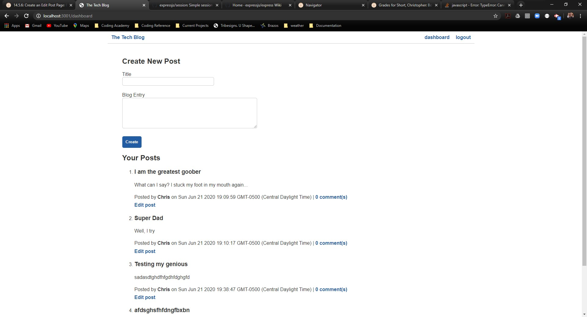

  
  
  # The Tech Blog
  
  
  
  ## Table of Contents
[Description](#Description)     
  
[Languages/Technologies](#Languages/Technologies)
  
[Installation Instructions](#Installation)
  
[Usage Instructions](#Usage)
  
[License](#License)
  
[Contribution](#Contribution)
  
[Testing](#Testing)
  
[Acknowledgements](#Acknowledgements)
  
[Questions](#Questions)
  
  ## Description 
  ---
  A web application to create, store, and edit a technology blog.
  
  ## Languages/Technologies
  ---
  HTML, CSS, JavaScript, MySQL, Sequelizer, Express, Handlebars, bcrypt, Node.js
  
  ## Installation Instructions
  ---
  Run 'npm init' and 'npm install' in the command line.
  
  ## Usage Instructions
  ---
  Create a new user account.  Click on eith er the "dashboard" or "The Tech Bolg" links at the top.
  
  ## License
  ---
  Licensed under the MIT license.
  
  ## Contribution
  ---
  https://calm-mesa-69815.herokuapp.com
  none
  
  ## Testing
  ---
  none
  
  ## Acknowledgements 
  ---
  none
  
  ## Questions
  ---
  [GitHub](https://github.com/durcoorigin) profile.

  E-mail: twitchshort@gmail.com
  
  ### Built by Chris Short 
  

